# INTELLISEARCH Data Flow Diagram (Updated November 2025)

## System Architecture & Data Flow

```mermaid
graph LR
    %% Input Layer
    User[👤 User Input<br/>Research Query] --> API{🌐 Interface}
    API --> CLI[💻 Command Line<br/>app.py]
    API --> Web[🖥️ Web Application<br/>React + FastAPI]
    
    %% Core Processing Engine
    CLI --> Workflow[🔄 LangGraph Workflow<br/>graph.py]
    Web --> Workflow
    
    %% Query Generation & Processing
    Workflow --> QueryGen[🧠 LLM Query Generation<br/>create_queries]
    QueryGen --> GoogleLLM[🤖 Google Gemini<br/>Advanced Prompting]
    GoogleLLM --> Queries[📝 Optimized Search Queries]
    
    %% Search & Content Extraction
    Queries --> Search[🔍 Web Search<br/>Serper API]
    Search --> URLs[🔗 Search Result URLs]
    URLs --> Scraper[🌐 Multi-Strategy Scraper<br/>requests-html + aiohttp]
    Scraper --> RawContent[📄 Raw Web Content]
    
    %% Hybrid Retrieval Processing
    RawContent --> ContentProcessor[⚙️ Content Processing<br/>Text Splitting + Cleaning]
    ContentProcessor --> HybridRetriever[🔀 Hybrid Retrieval System]
    
    %% Hybrid Retrieval Components
    HybridRetriever --> VectorStore[🧮 Vector Embeddings<br/>Google Gemini Embeddings]
    HybridRetriever --> BM25[📊 BM25 Search<br/>Traditional Keyword Search]
    VectorStore --> Ensemble[⚡ Custom EnsembleRetriever<br/>Reciprocal Rank Fusion]
    BM25 --> Ensemble
    
    %% Document Processing & Evaluation
    Ensemble --> RelevantDocs[📋 Relevant Documents<br/>Ranked & Deduplicated]
    RelevantDocs --> AIEval[🤖 AI Evaluation<br/>Information Sufficiency]
    AIEval --> Decision{❓ Sufficient Info?}
    
    %% Decision Logic
    Decision -->|No| FeedbackLoop[🔄 Refinement Loop<br/>More Search Iterations]
    FeedbackLoop --> Search
    Decision -->|Yes| ReportGen[📝 Report Generation]
    
    %% Report Generation
    ReportGen --> ReportLLM[🤖 Google Gemini<br/>Report Writing]
    ReportLLM --> Citations[📚 Citation Processing<br/>Academic Style References]
    Citations --> FinalReport[📄 Final Research Report<br/>Markdown + PDF]
    
    %% Output Layer
    FinalReport --> CLIOutput[💻 Terminal Output<br/>Markdown + PDF Files]
    FinalReport --> WebOutput[🖥️ Web Interface<br/>Interactive Display]
    
    %% Configuration & APIs
    Config[⚙️ Configuration<br/>config.py] --> GoogleLLM
    Config --> VectorStore
    Config --> Search
    APIKeys[🔑 API Keys<br/>Google + Serper] --> Config
    
    %% Styling
    classDef input fill:#e3f2fd,stroke:#1565c0,stroke-width:2px
    classDef process fill:#f3e5f5,stroke:#7b1fa2,stroke-width:2px
    classDef hybrid fill:#e8f5e8,stroke:#2e7d32,stroke-width:3px
    classDef ai fill:#fff3e0,stroke:#f57c00,stroke-width:2px
    classDef output fill:#fce4ec,stroke:#c2185b,stroke-width:2px
    classDef config fill:#f1f8e9,stroke:#558b2f,stroke-width:2px
    
    class User,API input
    class QueryGen,ContentProcessor,Scraper,Search process
    class HybridRetriever,VectorStore,BM25,Ensemble hybrid
    class GoogleLLM,AIEval,ReportLLM ai
    class FinalReport,CLIOutput,WebOutput output
    class Config,APIKeys config
```



## Data Types & State Management

### 🗂️ **Core Data Structures**

#### AgentState (TypedDict)
```python
{
    "user_query": str,              # Original research question
    "search_queries": List[str],    # Generated search queries
    "search_results": List[SearchResult],  # Web search results
    "scraped_content": List[ScrapedContent],  # Extracted content
    "relevant_contexts": Dict,      # Processed & relevant content
    "search_iteration_count": int,  # Loop tracking
    "approval_iteration_count": int, # User approval tracking
    "proceed": bool,               # Decision state
    "final_report": str,           # Generated report
    "report_type": str,            # concise/detailed
    "citations": List[str]         # Source citations
}
```

#### Document Processing Pipeline
```
Raw HTML/Text → Clean Text → Text Chunks → Vector Embeddings
                    ↓              ↓              ↓
              BM25 Indexing → Hybrid Search → Ranked Results
```

### 🔄 **Processing Flow Stages**

#### 1. **Query Intelligence** 
- **Input**: Natural language research question
- **Processing**: LLM-based analysis and query generation
- **Output**: Multiple optimized search queries
- **Enhancement**: Replaced regex-based question_analyzer with AI

#### 2. **Information Gathering**
- **Input**: Search queries
- **Processing**: Web search → URL extraction → Content scraping
- **Output**: Raw content with metadata
- **Features**: Multi-strategy scraping, error handling

#### 3. **Hybrid Retrieval Processing**
- **Input**: Raw scraped content
- **Processing**: Text splitting → Embedding generation → BM25 indexing
- **Output**: Searchable hybrid index
- **Innovation**: Custom EnsembleRetriever with RRF

#### 4. **Content Extraction & Ranking**
- **Input**: User query + Hybrid index
- **Processing**: Vector similarity + BM25 scoring → Fusion → Deduplication
- **Output**: Ranked relevant document chunks
- **Optimization**: Weighted scoring and reciprocal rank fusion

#### 5. **Intelligent Evaluation**
- **Input**: Extracted content + Original query
- **Processing**: AI-powered sufficiency assessment
- **Output**: Continue/Proceed decision
- **Logic**: Iterative refinement with max iteration limits

#### 6. **Report Synthesis**
- **Input**: Relevant content + Query context
- **Processing**: LLM-based report generation + Citation formatting
- **Output**: Structured research report with citations
- **Formats**: Markdown, PDF, Web display

## Integration Architecture

### 🌐 **Multi-Interface Support**
- **CLI**: Direct command-line execution (`app.py`)
- **Web App**: React frontend + FastAPI backend
- **Batch Processing**: Multiple queries from file
- **API**: RESTful endpoints for programmatic access

### 🔧 **Configuration Management**
- **API Keys**: Centralized in `config.py`
- **Retrieval Settings**: Hybrid weights, fusion methods
- **Report Settings**: Word limits, citation styles
- **Performance**: Timeouts, rate limits, retry logic

### 📊 **Monitoring & Validation**
- **Startup Validation**: Environment and dependency checks
- **Error Handling**: Graceful fallbacks and retry mechanisms
- **Progress Tracking**: Real-time status updates
- **Testing**: Comprehensive test suite for all components

---

**Updated**: November 4, 2025  
**Architecture**: Hybrid AI + Traditional Search  
**Status**: Production-Ready with Cleanup Optimizations