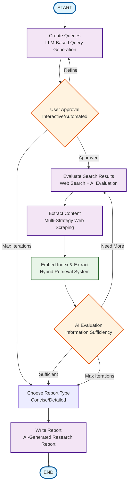

# INTELLISEARCH Workflow Diagram (Updated November 2025)

## LangGraph Workflow Architecture



## Key Workflow Components

### 🧠 **LLM-Based Query Generation**
- **Node**: `create_queries`
- **Enhancement**: Replaced rule-based question_analyzer with AI-powered query generation
- **Features**: Context-aware, domain-specific, multi-language support

### 🔍 **Hybrid Retrieval System** 
- **Node**: `embed_index_and_extract`
- **Enhancement**: Custom EnsembleRetriever with BM25 + Vector Search
- **Features**: Reciprocal Rank Fusion, weighted scoring, deduplication

### 🌐 **Multi-Strategy Web Scraping**
- **Node**: `extract_content`
- **Features**: requests-html, aiohttp, fallback methods
- **Error Handling**: Robust retry mechanisms

### 🤖 **AI Evaluation Loop**
- **Nodes**: `AI_evaluate`, `user_approval`
- **Features**: Information sufficiency assessment, iterative refinement
- **Limits**: Max 5 search iterations, 3 approval cycles

## Workflow Decision Points

### User Approval Routing
```
if approval_iteration_count >= 3:
    → choose_report_type (skip to report)
elif proceed == True:
    → evaluate_search_results (continue search)
else:
    → create_queries (refine queries)
```

### AI Evaluation Routing
```
if search_iteration_count >= 5:
    → choose_report_type (force completion)
elif proceed == True:
    → choose_report_type (sufficient info)
else:
    → evaluate_search_results (gather more info)
```

## Integration Points

### 📊 **Data Flow**
- **AgentState**: Unified state management across nodes
- **Document Processing**: Consistent document handling with metadata
- **Progress Tracking**: Iteration counts and decision history

### 🔧 **Configuration**
- **API Keys**: Google Gemini, Serper integration
- **Hybrid Retrieval**: Configurable weights and fusion methods
- **Report Types**: Concise (~500 words) or Detailed (~1000 words)

---

**Updated**: November 4, 2025  
**Status**: Post-Cleanup Optimization  
**Architecture**: LangGraph + Google Gemini + Hybrid Retrieval